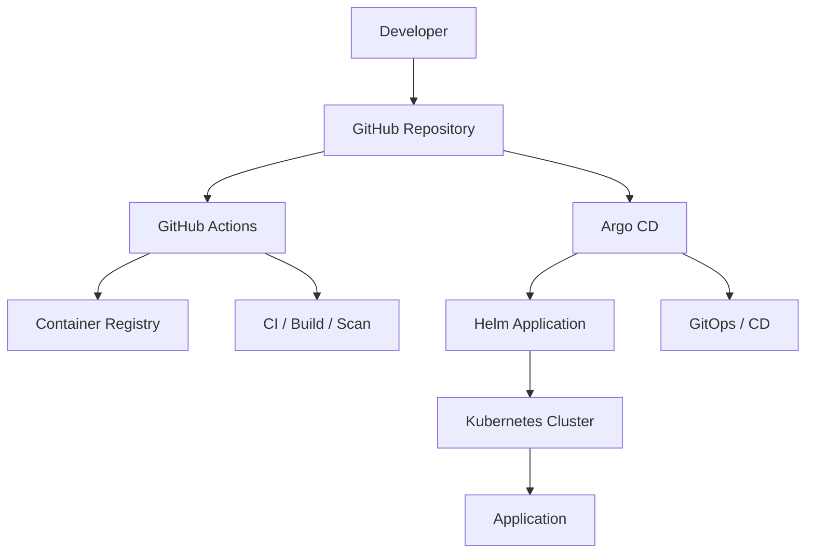

# Argo CD GitOps Project

## Overview

This project demonstrates a GitOps-based Continuous Delivery implementation using:

- Argo CD
- Kubernetes
- Helm
- GitHub
- GitHub Actions
- Docker
- Container Registry

The objective is to demonstrate how Argo CD can manage Kubernetes application deployments using Git as the source of truth.

The application is packaged using Helm and deployed to Kubernetes through Argo CD.

---

## Architecture



### GitOps Flow

```text
Developer
    |
    v
Git Push
    |
    v
GitHub
    |
    +--------------------------+
    |                          |
    v                          v
GitHub Actions              Argo CD
    |                          |
    | CI                       | CD
    |                          |
    v                          v
Container Registry       Compare Git vs Cluster
                               |
                               v
                         Kubernetes Cluster
```

GitHub Actions is responsible for CI activities such as build, test and image publishing.

Argo CD is responsible for Continuous Delivery and maintaining the desired Kubernetes state.

---

# What is Argo CD?

Argo CD is a Kubernetes-native GitOps Continuous Delivery tool.

It continuously monitors a Git repository containing the desired configuration of an application and compares it with the live state running in Kubernetes.

If the desired state and live state are different, Argo CD identifies the application as:

```text
OutOfSync
```

Argo CD can then synchronize the Kubernetes cluster with the desired state stored in Git.

The basic model is:

```text
Git Repository
      |
      | Desired State
      v
   Argo CD
      |
      | Reconciliation
      v
Kubernetes Cluster
      |
      | Live State
      v
 Application
```

Git acts as the source of truth.

---

# Why Argo CD?

A traditional CI/CD deployment can look like:

```text
Developer
    |
    v
GitHub
    |
    v
CI Pipeline
    |
    +-- Build
    +-- Test
    +-- Docker Build
    |
    v
kubectl apply
    |
    v
Kubernetes
```

In this model, the CI system needs direct access to the Kubernetes cluster.

With GitOps:

```text
Developer
    |
    v
GitHub
    |
    v
GitHub Actions
    |
    +-- Build
    +-- Test
    +-- Security Scan
    |
    v
Container Registry


Git Repository
    |
    v
Argo CD
    |
    v
Kubernetes
```

The CI pipeline does not need to directly deploy Kubernetes resources.

Instead, the desired configuration is maintained in Git.

Argo CD detects the Git change and reconciles the Kubernetes cluster.

---

# Benefits

Argo CD provides:

- Git as the source of truth
- Declarative deployments
- Automated synchronization
- Self-healing
- Automatic pruning
- Drift detection
- Application health monitoring
- Deployment history
- Git-based rollback
- Auditability
- Helm and Kustomize support
- Multi-environment deployment support

---

# GitOps Principles

## Declarative Configuration

The desired state is defined using configuration files.

For example:

```yaml
replicas: 2
```

Instead of manually running:

```bash
kubectl scale deployment app --replicas=2
```

the desired state is stored in Git.

---

## Version Controlled

Every configuration change is stored in Git.

```text
Commit A
replicas: 2
      |
      v
Commit B
replicas: 3
```

This provides deployment history and makes changes reviewable.

---

## Automated Reconciliation

Argo CD continuously compares:

```text
Desired State
     |
     v
   Argo CD
     |
     v
  Live State
```

If the states differ, Argo CD detects the drift.

---

# Argo CD Architecture

```text
                         Git Repository
                              |
                              v
                    +---------------------+
                    | Repository Server   |
                    +---------------------+
                              |
                              v
                    +---------------------+
                    |    API Server       |
                    +---------------------+
                       |             |
                       v             v
                     Web UI         CLI
                                      |
                                      v
                    +---------------------+
                    | Application         |
                    | Controller          |
                    +---------------------+
                              |
                              v
                       Kubernetes API
                              |
                              v
                    Kubernetes Cluster
```

## API Server

Provides:

- Web UI
- CLI/API access
- Authentication
- RBAC
- Application management
- Repository configuration
- Sync operations

## Repository Server

Responsible for:

- Connecting to Git repositories
- Fetching application configuration
- Rendering Helm charts
- Rendering Kustomize applications
- Generating Kubernetes manifests

## Application Controller

Responsible for:

- Comparing desired and live state
- Detecting drift
- Synchronizing applications
- Monitoring application health
- Self-healing

---

# Helm and Argo CD

Helm and Argo CD solve different problems.

### Helm

Helm is used for Kubernetes application packaging and templating.

```text
values.yaml
     |
     v
Helm Templates
     |
     v
Kubernetes YAML
```

### Argo CD

Argo CD is used for GitOps-based Continuous Delivery.

```text
Git
 |
 v
Argo CD
 |
 v
Kubernetes
```

In this project, Helm is used to package the application and Argo CD manages its deployment lifecycle.

---

# Repository Structure

```text
argocd-gitops-project/
│
├── README.md
│
├── helm/
│   └── argocd-demo/
│       ├── Chart.yaml
│       ├── values.yaml
│       ├── values-dev.yaml
│       ├── values-prod.yaml
│       │
│       └── templates/
│           ├── deployment.yaml
│           ├── service.yaml
│           └── ingress.yaml
│
├── argocd/
│   ├── application.yaml
│   ├── project.yaml
│   └── applicationset.yaml
│
└── scripts/
    ├── install-argocd.sh
    └── verify-argocd.sh
```

---

# Helm Chart Structure

The application is packaged as a Helm chart.

```text
helm/
└── argocd-demo/
    │
    ├── Chart.yaml
    ├── values.yaml
    ├── values-dev.yaml
    ├── values-prod.yaml
    │
    └── templates/
        ├── deployment.yaml
        ├── service.yaml
        └── ingress.yaml
```

---

# Installing Argo CD Using Helm

Add the Argo Helm repository:

```bash
helm repo add argo https://argoproj.github.io/argo-helm
```

Update the repository:

```bash
helm repo update
```

Verify the chart:

```bash
helm search repo argo/argo-cd
```

Create the namespace:

```bash
kubectl create namespace argocd
```

Install Argo CD:

```bash
helm upgrade --install argocd argo/argo-cd \
  --namespace argocd \
  --create-namespace
```

Using `upgrade --install` makes the command idempotent.

---

# Verify Argo CD Installation

Check pods:

```bash
kubectl get pods -n argocd
```

Check services:

```bash
kubectl get svc -n argocd
```

Check Helm release:

```bash
helm list -n argocd
```

Expected:

```text
NAME      NAMESPACE   STATUS
argocd    argocd      deployed
```

---

# Argo CD Values

Argo CD can be configured through Helm values.

Example:

```yaml
server:
  replicas: 2

repoServer:
  replicas: 2

controller:
  replicas: 2
```

Install using a values file:

```bash
helm upgrade --install argocd argo/argo-cd \
  --namespace argocd \
  --create-namespace \
  --values helm/argocd/values.yaml
```

Environment-specific values can also be maintained:

```text
values-dev.yaml
values-prod.yaml
```

---

# Argo CD Application

The Argo CD `Application` defines:

- Git repository
- Git branch
- Application path
- Helm configuration
- Kubernetes cluster
- Namespace
- Synchronization policy

Example:

```yaml
apiVersion: argoproj.io/v1alpha1
kind: Application

metadata:
  name: argocd-demo
  namespace: argocd

spec:
  project: default

  source:
    repoURL: https://github.com/YOUR_USERNAME/argocd-gitops-project.git
    targetRevision: main
    path: helm/argocd-demo

    helm:
      valueFiles:
        - values.yaml

  destination:
    server: https://kubernetes.default.svc
    namespace: argocd-demo

  syncPolicy:
    automated:
      prune: true
      selfHeal: true

    syncOptions:
      - CreateNamespace=true
```

Apply the application:

```bash
kubectl apply -f argocd/application.yaml
```

Check:

```bash
kubectl get applications -n argocd
```

---

# Automated Synchronization

Argo CD can automatically synchronize changes from Git.

Configuration:

```yaml
syncPolicy:
  automated:
    prune: true
    selfHeal: true
```

---

# Self-Healing

Self-healing allows Argo CD to automatically correct configuration drift.

Suppose Git defines:

```yaml
replicas: 2
```

A user manually changes Kubernetes:

```bash
kubectl scale deployment argocd-demo \
  --replicas=5 \
  -n argocd-demo
```

Now:

```text
Git desired state:     2 replicas
Kubernetes live state: 5 replicas
```

Argo CD detects the drift.

With:

```yaml
selfHeal: true
```

Argo CD reconciles the application back to:

```text
2 replicas
```

---

# Automatic Pruning

Pruning removes resources that no longer exist in the desired Git state.

For example:

```text
Git:
    deployment.yaml
    service.yaml
    configmap.yaml
```

If `configmap.yaml` is removed from Git and pruning is enabled, Argo CD can remove the corresponding Kubernetes resource.

Configuration:

```yaml
automated:
  prune: true
```

---

# Sync Status

Argo CD provides application synchronization status.

Common states:

```text
Synced
OutOfSync
Unknown
```

### Synced

Git and Kubernetes states match.

### OutOfSync

Git and Kubernetes states differ.

### Unknown

Argo CD cannot determine the current state.

---

# Application Health

Argo CD also monitors application health.

Common states:

```text
Healthy
Progressing
Degraded
Suspended
Missing
Unknown
```

Expected healthy application:

```text
Sync Status:   Synced
Health Status: Healthy
```

---

# Manual Synchronization

Applications can also be synchronized manually.

```bash
argocd app sync argocd-demo
```

Get application details:

```bash
argocd app get argocd-demo
```

List applications:

```bash
argocd app list
```

---

# ApplicationSet

ApplicationSet can be used to manage multiple environments or applications.

Example:

```text
ApplicationSet
     |
     +---- Development
     |
     +---- Staging
     |
     +---- Production
```

Instead of creating separate `Application` resources manually, ApplicationSet can generate them based on configured generators.

This is useful for multi-environment GitOps deployments.

---

# Argo CD Project

An Argo CD `AppProject` provides logical grouping and access control.

It can control:

- Allowed Git repositories
- Kubernetes destinations
- Namespaces
- Cluster resources

Example:

```yaml
apiVersion: argoproj.io/v1alpha1
kind: AppProject

metadata:
  name: platform
  namespace: argocd

spec:
  description: Platform applications

  sourceRepos:
    - https://github.com/YOUR_USERNAME/*

  destinations:
    - namespace: platform-*
      server: https://kubernetes.default.svc
```

---

# Access Argo CD

For a lab environment, use port forwarding:

```bash
kubectl port-forward \
  svc/argocd-server \
  -n argocd \
  8080:443
```

Open:

```text
https://localhost:8080
```

Retrieve the initial password:

```bash
kubectl -n argocd get secret \
  argocd-initial-admin-secret \
  -o jsonpath="{.data.password}" | base64 -d
```

---

# Helm Validation

Validate the application chart:

```bash
helm lint ./helm/argocd-demo
```

Render the chart locally:

```bash
helm template argocd-demo ./helm/argocd-demo
```

This allows Kubernetes manifests to be validated before deployment through Argo CD.

---

# Troubleshooting

## Check Argo CD Pods

```bash
kubectl get pods -n argocd
```

Describe a pod:

```bash
kubectl describe pod <POD_NAME> -n argocd
```

View logs:

```bash
kubectl logs <POD_NAME> -n argocd
```

---

# Rollback

Git provides a version-controlled deployment history.

Example:

```text
Commit A
Version 1.0
    |
    v
Commit B
Version 1.1
    |
    v
Commit C
Version 1.2
```

If version 1.2 introduces an issue, revert the Git change:

```bash
git revert <COMMIT_SHA>
git push origin main
```

Argo CD detects the Git change and synchronizes the previous desired state.


---


---

